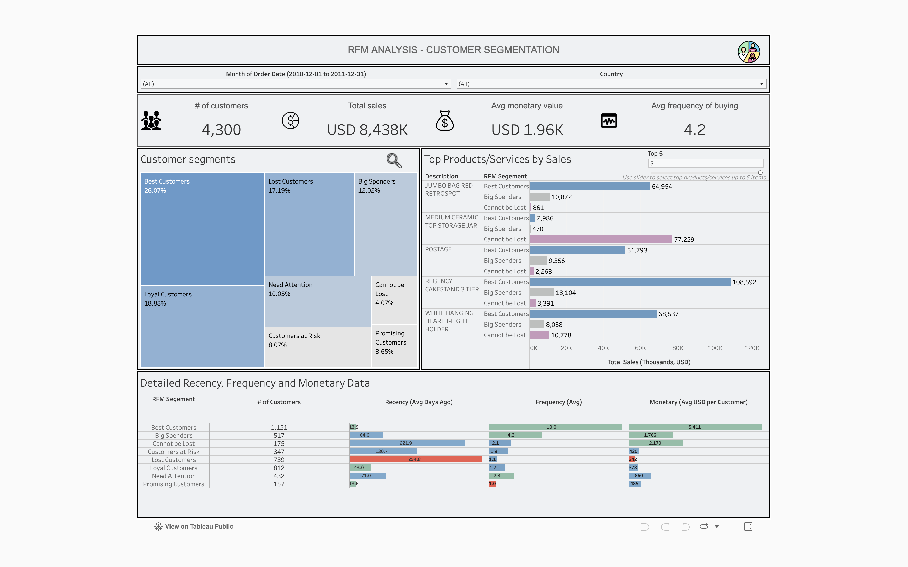

# Customer Segmentation and Recency, Frequency and Monetary Analysis with SQL and Tableau

## Project Description
**RFM Analysis** is an effective method to analyze customer behavior by evaluating recency, frequency and monetary values of customer's purchases. Thus, current project aims to analyse customer behavior for online business specialising in home and garden products, and present insights to the marketing team.  

Analysis was conducted by segmenting customers into 7 groups based on their RFM traits and analysing RFM values.  The groups that customers were segmented into are as follows:  
    1. _Best Customers_ - completed a recent purchase, buy frequently and spend the most  
    2. _Big Spenders_ - buy frequently and spend a lot of money  
    3. _Loyal Customers_ - recently spent a fair amount of money more than once  
    4. _Promising Customers_ - completed a recent purchase but do not order often  
    5. _Customers at Risk_ - completed big and recent purchases long ago  
    6. _Cannot be Lost_ - completed huge, frequent purchases long ago but have not returned  
    7. _Lost Customers_ - lowest scores in recency, frequency and monetary values  

## Dataset Information
- **Source**: Internal data, using *turing_data_analytics.rfm*
- **Description**:  
The dataset contains the following information:
    - Invoice Number
    - Stock Code
    - Product Description
    - Product Quantity in Given Order
    - Invoice Date
    - Unit Price
    - Customer ID
    - Order Origin Country
- **Number of Observations**: 541,909
- **Number of Features**: 8
- **Sample Data**:  
Below is an example of what the data might look like:

## Disclaimer
_The project was performed for learning purposes. Insights should not be taken as a professional advice._  

## Prerequisites
To run the project, the following is required:
- SQL
- Tableau Public

## Analysis Process
1. SQL query to calculate RFM values, convert to RFM scores and segment customers.  
Example of data after running the query:

2. Additional SQL query to pull customer's country.  
_Country was not included in the initial query because some customers demonstrated tendency to order from several countries. Pulling data with separate query and then joining it in Tableau allows correct data interpretation._  
Example of data after running the query:

3. Additional SQL query to pull products and their quantities that customers ordered and total sales they generated.  
Example of data after running the query:

4. Visualising data with Tableau Dashboard.  
Example of how Tableau Dashboard looks like:
   
To access the dashboard please visit: https://public.tableau.com/views/MAT_S3_RFM_GVA/Dashboard1?:language=en-GB&:sid=&:redirect=auth&:display_count=n&:origin=viz_share_link 

## Key Takeaways
- Time period analysed - 1 year (from 2010-12-01 to 2011-12-01).
- Online business in question attracts customers from a wide variety of countries. However, majority of customers (3,889 out of 4,300) are based in the United Kingdom.
- "Best Customers" is the biggest segment accounting for 26.07% of all customers. On average each customer in this segment spent 5,411 USD, ordered at least 10 times and 13.9 days ago.
 - "Promising Customers" is the smallest segment and accounts only for 3.65% of all customers. Customers in this segment ordered most recently, i.e. 13.6 days ago but made only one purchase. On average customer in this segment spends 485 USD.
- "Lost Customers" account for 17.19% of all customers and are unlikely to return. Customers in this segment made their last purchase 254.8 days ago on average and spent least - on average customer spent only 242 USD.
- "Loyal Customers" account for 18.88% of all customers. Customers in this did not spent so much on their orders (on average 378 USD per customer) but they do orders are fairly frequent.
- "Big Spenders" account for 12.02% of all customers. On average they have spent 1,766 USD per customer, they order frequently and their most recent order was made 64.6 days ago.
- "Cannot be Lost" account for just 4.07% of all customers. Customers in  this segment spend most after the "Best Customers" with an average of 2,170 USD per customer. However, they do not order very frequently and on average, their last order was made 221.9 days ago.

## Insights for the Marketing Team
- It is advised to focus on "Best Customers", "Big Spenders" and "Cannot be Lost" customer segments as they generate the highest monetary value (sales) for the business in question.
- To maintain customers in "Best Customers" segment it is advised to reward them with special discounts for their favourite products like _Regency cakestand 3 tier_ or offer to become early adopters of a new products.
- To maintain customers in "Big Spenders" segment it is advised to upsell by offering high value items for customers in this segment and ask for reviews.
- To maintain customers in "Cannot be Lost" segment it is advised to make them more aware of the business brand. Customers in this sergment could be offered gifts and free trials for postage.