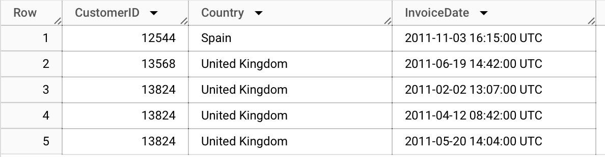

# Customer Segmentation and Recency, Frequency and Monetary Analysis with SQL and Tableau

## Project Description
**RFM Analysis* is an effective method to analyze customer behavior by evaluating recency, frequency and monetary values of customer's purchases. Thus, current project aims to analyse customer behavior for online business specialising in home and garden products, and present insights to the marketing team. Analysis was conducted by segmenting customers into 7 groups based on their RFM traits and analysing RFM values.  The groups that customers were segmented into are as follows:  
    1. _Best Customers_ - completed a recent purchase, buy frequently and spend the most
    2. _Big Spenders_ - buy frequently and spend a lot of money
    3. _Loyal Customers_ - recently spent a fair amount of money more than once
    4. _Promising Customers_ - completed a recent purchase but do not order often
    5. _Customers at Risk_ - completed big and recent purchases long ago
    6. _Cannot be Lost_ - completed huge, frequent purchases long ago but have not returned
    7. _Lost Customers_ - lowest scores in recency, frequency and monetary values

## Dataset Information
- **Source**: Internal data, using *turing_data_analytics.rfm*
- **Description**:  
The dataset contains the following information:
    - Invoice Number
    - Stock Code
    - Product Description
    - Product Quantity in Given Order
    - Invoice Date
    - Unit Price
    - Customer ID
    - Order Origin Country
- **Number of Observations**: 541,909
- **Number of Features**: 8
- **Sample Data**:  
Below is an example of what the data might look like:

## Disclaimer
_The project was performed for learning purposes. Insights should not be taken as a professional advice._  

## Prerequisites
To run the project, the following is required:
- SQL
- Tableau Public

## Analysis Process
1. SQL query to calculate RFM values, convert to RFM scores and segment customers.  
Example of data after running the query:

2. Additional SQL query to pull customer's country.  
_Country was not included in the initial query because some customers demonstrated tendency to order from several countries. Pulling data with separate query and then joining it in Tableau allows correct data interpretation._  
Example of data after running the query:

3. Additional SQL query to pull products and their quantities that customers ordered and total sales they generated.  
Example of data after running the query:

4. Visualising data with Tableau Dashboard

## Key Takeaways
- Time period analysed - 1 year (from 2010-12-01 to 2011-12-01)