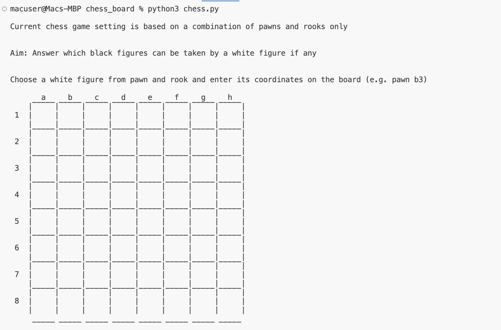
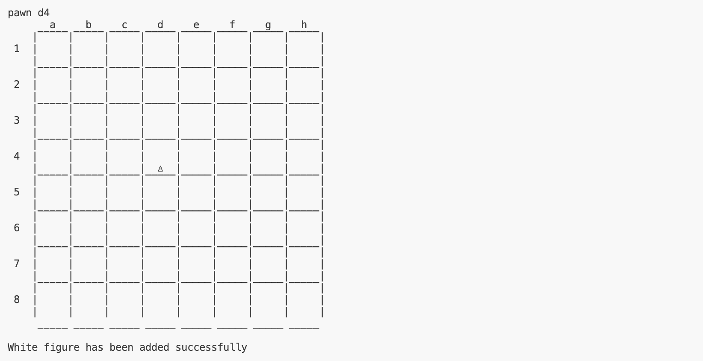
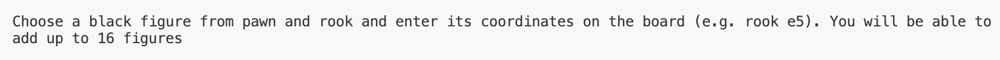
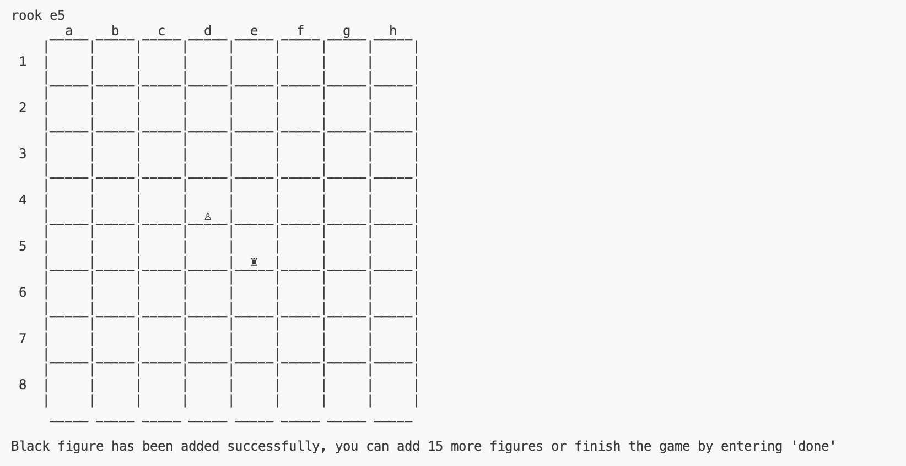
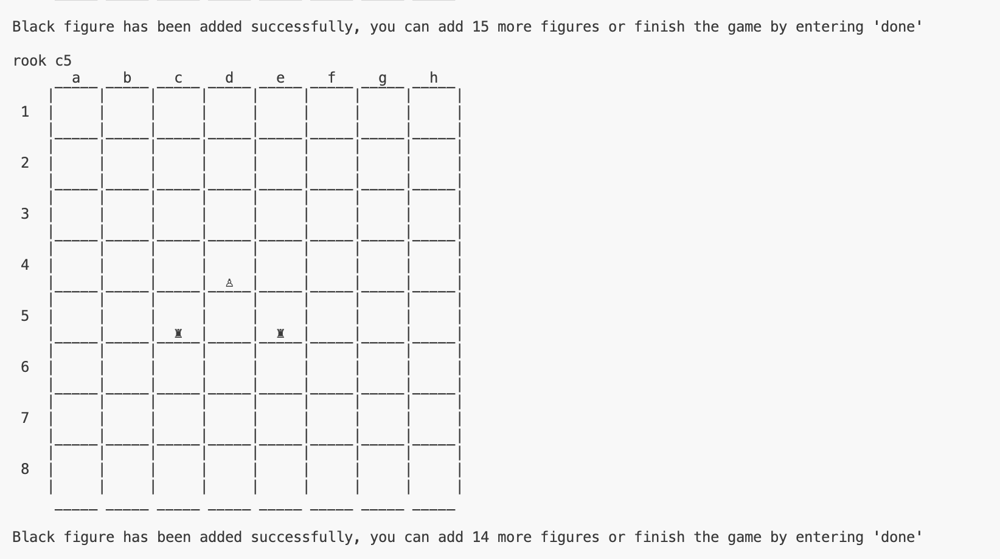
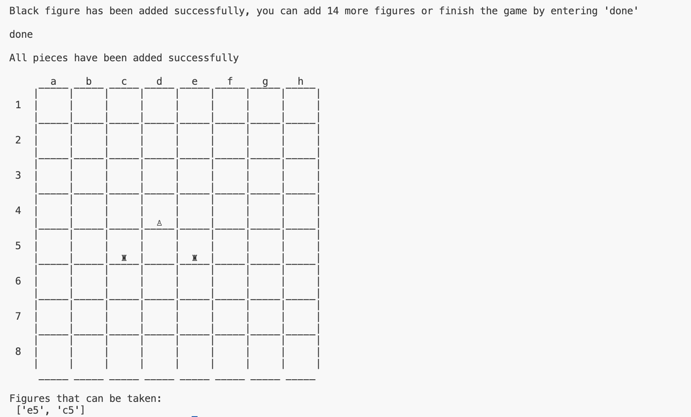

# Chess Board Analysis with Python

## Project Description
Current project aims to answer one question "Which black chess figures can be captured by the white chess figure on a given chess board state?".  
To answer project's question, a Python programme was implemented. Programme prompts the user to alocate chess figures on the chess board and returns coordinates of the figures that can be captured if any.
_The programme was created with little background in chess game, thus, displaying unconventional layout of the grame. The following is assumed:_
- The only figures to be present on the chess board are either pawn or rook.
- Only 1 white figure (pawn/rook) can be present.
- No less than 1 and no more than 16 black figures (pawn/s or rook/s) can be present.
- White figure is moving downard from top of the board (row 1) to the bottom (row 8).

## Disclaimer
_The project was performed for learning purposes. Insights should not be taken as a professional advice._

## Prerequisites
To run current programme, the following is required:
- Python

## Demonstration
1. After running the programme, the user is introduced with the game setting and aim. The user is then prompted to allocate a white figure to the chess board by entering name of the figure and its coordinates. Board state is also printed for visualisation purposes.  

2. Once user inputs the name of the white figure and its coordinates, programme prints the board state to clearly illustrate where the figure stands. It also notifies the user that the figure was added successfully.  

3. User is then prompted to allocate black figure to the chess board by entering name of the figure and its coordinates.  

4. Once the user inputs the name of the black figure and its coordinates, programme prints the board state to clearly understand where the figures stand. It also notifies the user that the figure is added successfully and that it is possible to add 15 more figures or finish the game by entering 'done'.  

5. **For demonstration purposes let's add 1 more black figure.**  

6. Once the user is satisfied with the board view, the game can be finished by entering 'done'.  
7. After hitting 'done', the programme notifies the player that all figures have been added successfully and prints final view of the chess board. Finally and most importantly, programme reveals coordinates of the figures which can be captured.  
