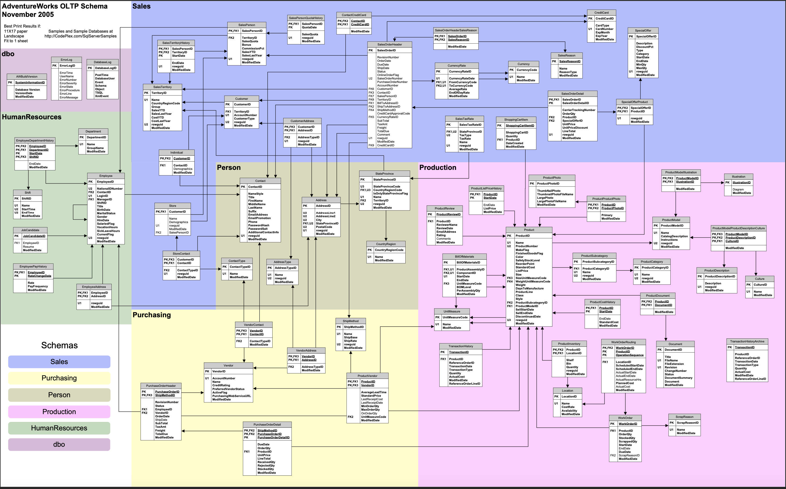
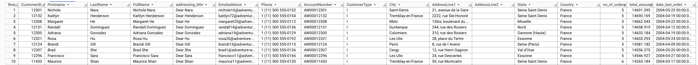
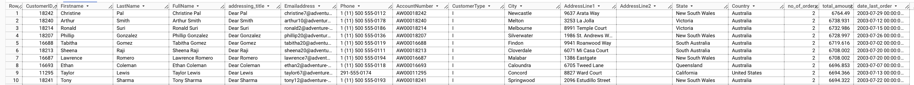
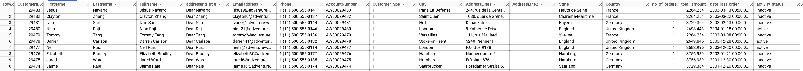
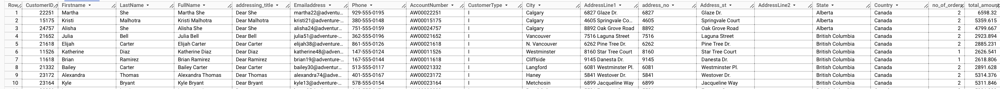
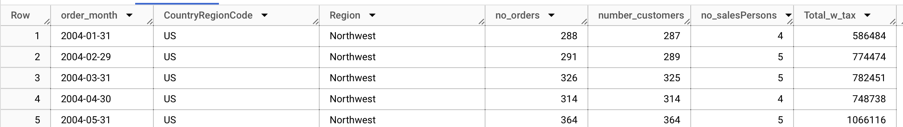
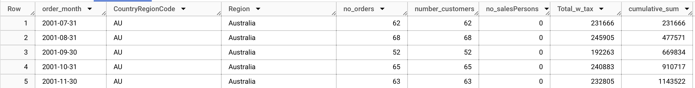
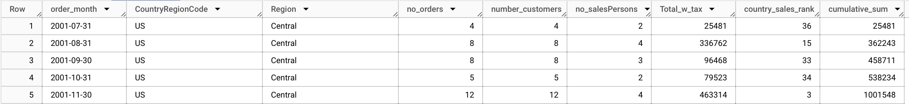
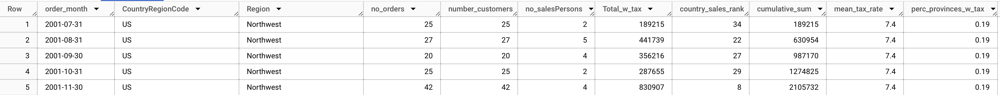

# Data Preparation for Analysis with SQL

## Project Description
Current project focuses on preparing data from fictitious _"AdventureWorks"_ company for further analysis as per managerial requests. These requests primarily covered customer and sales data. To prepare required data, a total of 8 SQL queries were executed.

## Dataset Information
- **Source**: [AdventureWorks Data set](https://learn.microsoft.com/en-us/sql/samples/adventureworks-install-configure?view=sql-server-ver16&tabs=ssms)
- **Description**: An online transaction processing databse of a fictitious, multinational manufacturing company that sells bicycles and cycling accessories.  

For detailed composition of the database please refer to the schema below:  

## Disclaimer
_The project was performed for learning purposes. Insights should not be taken as a professional advice._  

## Prerequisites
To run the project, the following is required:
- SQL

## Contents
Request 1. **Detailed overview of all individual customers**, requested data is as follows:
    - Customer ID, Title, First and Last Names
    - Email and Phone
    - Account Number
    - Customer Type (individual)
    - City, State, Country, and Address
    - Number of Orders, Total Amount Spent with Taxes and Date of the Last Order
Example data after running the query:  
  

Request 2. **Top 200 customers with highest total amount (with tax) who did not order over the last year**. Current query is a complemented query from the previous request.
Example data after running the query:
  

Request 3. **Active and inactive customers**. Customer activity was defined as _active_ if order was made within last year, and _inactive_ if no order was made within last year. Current query is a complemented query from request 1.  
Example data after running the query:
  

Request 4. **Top active customers from North America**. Top customers were defined either by their total spendings (with Tax) or orders frequency. If a custumer spent at least 2.5k or ordered at least 5 times then it is top customer. It was also requested to divide address line into 2 columns.  Example data after running the query:
  

Request 5. **Monthly sales numbers**. Requested data is as follows:  
    - Order Month
    - Number of Orders
    - Number of Customers
    - Number of Sales Representatives
    - Total Amount Earned with Tax 
Example data after running the query: 
  

Request 6. **Cumulative sum of the total amount earned with tax per country and region**. Current query is a complemented query from request 5.  
Example data after running the query:  
  

Request 7. **Monthly country rank by sales**. Country is ranked highest in a particular month if it earned highest total amount with tax. Conversely, country is ranked lowest if it earned lowest total amount with tax. Current query is a complemented query from request 6.  
Example data after running the query:

Request 8. **Taxes on a country level**. Current query is a complemented query from request 7.  
Example data after running the query:
  

